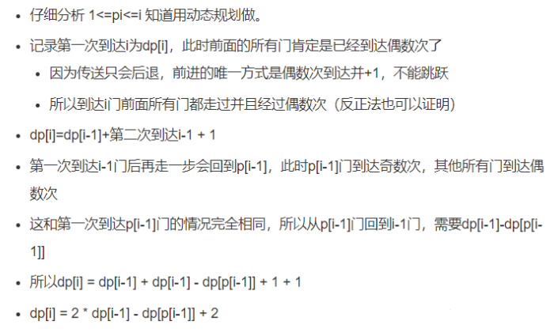

# 动态规划问题算法总结  
  
## 模型一： 0-1背包客问题   

> 算法出处：<a href="" target="_blank">0-1背包客</a>

#### 1.问题描述：
> 有一个背包可以装物品的总重量为W，现有N个物品，每个物品重w[i]，价值v[i]，用背包装物品，能装的最大价值是多少？

#### 2.问题分析  
> 背包承载是有限的，需要在有限的空间内实现背包的最大价值  
> 每个物品对于存放背包时，要考虑存放时的最大价值与不存放时的最大价值做比较   
  
> ① 当前物品存放与背包时   
>> 当前的价值为 : 前面几个物品存放时的价值 + 当前物品存放时的价值     
>> 存放当前物品时必须考虑背包的容量是否能存放该物品   
> 
> ② 不存放当前物品时，代表背包容量不能容纳下当前物品  
>> 不存放是的dp表示：dp[i][j] = dp[i-1][j-wi]   
>   
> 
> 假设一个二维坐标 横坐标代表的是背包的容量，纵坐标代表的是物品的价值  
> 可以用二维数组表示：dp[][]  
> dp[1][1]代表的是背包容量为1，存放物品1的价值    
> dp[2][1]代表的是背包容量为1，如果背包容量满足存放当前物品2，那么dp[1][2]代表的就是存放物品1和物品2的最大价值，否则就是存放物品1的最大价值  
> 
> dp[i][j]，表示前i个物品，背包重量为j的情况下能装的最大价值。      
例如，dp[3][4]=6，表示用前3个物品装入重量为4的背包所能获得的最大价值为6，此时并不是3个物品全部装入，而是3个物品满足装入背包的条件下的最大价值。
>   
> 通过分析得到状态转移方程dp[i][j] = j < wi ? dp[i-1][j] : dp[i][j] = j < wi?dp[i - 1][j]:Math.max(dp[i - 1][j],dp[i-1][j -wi] + wi * v1);   
> 
#### 3.实现
```java
public class Mode01 {

    public static void main(String[] args) throws IOException {
        BufferedReader bf = new BufferedReader(new InputStreamReader(System.in));
        String str;
        while ((str = bf.readLine()) != null) {
            int n = Integer.parseInt(str);
            String[] w = bf.readLine().split(" ");
            String[] v = bf.readLine().split(" ");
            int[][] dp = new int[w.length + 1][n + 1];
            for (int i = 1; i <= w.length; i++) {
                for (int j = 1; j <= n; j++) {
                    int wi = Integer.parseInt(w[i - 1]);
                    // dp[i-1][j -wi]代表不加当前物品前的最大价值
                    dp[i][j] = j < wi?dp[i - 1][j]:Math.max(dp[i - 1][j],dp[i-1][j -wi] + wi * Integer.parseInt(v[i -1]));
                }
            }
            System.out.println(dp[w.length][n]);
        }
    }
}

```

### 0-1模型变更问题1- 购物单


> 题目背景：https://www.nowcoder.com/practice/f9c6f980eeec43ef85be20755ddbeaf4?tpId=37&&tqId=21239&rp=1&ru=/ta/huawei&qru=/ta/huawei/question-ranking

> 王强今天很开心，公司发给N元的年终奖。王强决定把年终奖用于购物，他把想买的物品分为两类：主件与附件，附件是从属于某个主件的，下表就是一些主件与附件的例子：


| 主件 | 附件 |
|----- |--------|
| 电脑 |	打印机，扫描仪 |
| 书柜 |	图书 |
| 书桌 |	台灯，文具 |
| 工作椅 | 无 |  


> 如果要买归类为附件的物品，必须先买该附件所属的主件。每个主件可以有 0 个、 1 个或 2 个附件。附件不再有从属于自己的附件。王强想买的东西很多，为了不超出预算，他把每件物品规定了一个重要度，分为 5 等：用整数 1 ~ 5 表示，第 5 等最重要。他还从因特网上查到了每件物品的价格（都是 10 元的整数倍）。他希望在不超过 N 元（可以等于 N 元）的前提下，使每件物品的价格与重要度的乘积的总和最大。
设第 j 件物品的价格为 v[j] ，重要度为 w[j] ，共选中了 k 件物品，编号依次为 j 1 ， j 2 ，……， j k ，则所求的总和为：
v[j 1 ]*w[j 1 ]+v[j 2 ]*w[j 2 ]+ … +v[j k ]*w[j k ] 。（其中 * 为乘号）
请你帮助王强设计一个满足要求的购物单。
>
#### 1.输入描述：

> 输入的第 1 行，为两个正整数，用一个空格隔开：N m
> （其中 N （ <32000 ）表示总钱数， m （ <60 ）为希望购买物品的个数。）
> 从第 2 行到第 m+1 行，第 j 行给出了编号为 j-1 的物品的基本数据，每行有 3 个非负整数 v p q
> （其中 v 表示该物品的价格（ v<10000 ）， p 表示该物品的重要度（ 1 ~ 5 ）， q 表示该物品是主件还是附件。如果 q=0 ，表示该物品为主件，如果 q>0 ，表示该物品为附件， q 是所属主件的编号）

#### 2.输出描述：

> 输出文件只有一个正整数，为不超过总钱数的物品的价格与重要度乘积的总和的最大值（ <200000 ）。

#### 3.示例1

        输入：
            1000 5
            800 2 0
            400 5 1
            300 5 1
            400 3 0
            500 2 0
            复制
        输出：
            2200

#### 4.题目分析：

> 如果题目中没有附件的话就是典型的背包客0-1原型，那么我们在构建状态转移数组的时候先只考虑主件   
> 那么状态转移方程就是：  
> dp[i][j] = max{ dp[i-1][j] , dp[i-1][j - Vi] + Wi*Vi}
>
> i : 第i个主件  
> j ：购买金额  
> Vi: 当前主件的价格   
> Wi*Vi: 当前主键的价值
>

> 加上附件后：  
> 要考虑这点的只是考虑有附件的主键     
> 考虑每个物品时要考虑每种可能出现的情:  
> 1、主件   --一个主件最多有两个附件，题目给的条件          
> 2、主件+附件1   
> 3、主件+附件2  
> 4、主件+附件1+附件2
>
> 综上考虑状态转移方程转为：dp[i][j] = max(物品不放入背包, 主件, 主件+附件1, 主件+附件2, 主件+附件1+附件2)

#### 5.代码实现

```java  
    
    import java.util.*;

    /**
     * @author zhang.rongjun
     * @version 1.0
     * @date 2021/12/24 12:39
     * @description
     */
    public class Main {
    
    
        /*
        问题描述：有一个背包可以装物品的总重量为W，现有N个物品，每个物品重w[i]，价值v[i]，用背包装物品，能装的最大价值是多少？
         定义状态转移数组dp[i][j]，表示前i个物品，背包重量为j的情况下能装的最大价值。
        例如，dp[3][4]=6，表示用前3个物品装入重量为4的背包所能获得的最大价值为6，此时并不是3个物品全部装入，而是3个物品满足装入背包的条件下的最大价值。
           状态转移方程：
          dp[i][j] = max(dp[i-1][j], dp[i-1][j-w[i]]+v[i])
          dp[i-1][j]表示当前物品不放入背包，dp[i-1][j-w[i]]+v[i]表示当前物品放入背包，即当前第i个物品要么放入背包，要么不放入背包。
        */
    
        public static void main(String[] arg) {
            Scanner sc = new Scanner(System.in);
            int n = sc.nextInt();
            int m = sc.nextInt();
            Map<Integer, Goods> goods = new HashMap<>();
            int ma = 0;
            while (m-- > 0) {
                ma++;
                int v = sc.nextInt();
                int p = sc.nextInt();
                int q = sc.nextInt();
                if (q > 0) {
                    Goods master = goods.get(q);
                    Goods s = new Goods(0, v, p);
                    if (null == master) {
                        List<Goods> substandardGoods = new LinkedList<>();
                        substandardGoods.add(s);
                        master = new Goods(q, 0, 0);
                        master.setSubstandardGoods(substandardGoods);
                        goods.put(q, master);
                    } else {
                        master.getSubstandardGoods().add(s);
                    }
                } else {
                    Goods s = new Goods(ma, v, p);
                    if (null == goods.get(ma)) {
                        goods.put(s.getId(), s);
                    } else {
                        s.setSubstandardGoods(goods.get(ma).getSubstandardGoods());
                        goods.put(s.getId(), s);
                    }
                }
            }
            int size = n / 10 + 1;
            int[][] dp = new int[goods.size() + 1][size];
            for (int i = 0; i < goods.size() + 1; i++) dp[i][0] = 0;
            for (int i = 0; i < size; i++) dp[0][i] = 0;
            int c = 1;
            for (Map.Entry<Integer, Goods> g : goods.entrySet()) {
                Goods value = g.getValue();
                for (int i = 1; i < size; i++) {
                    if ((i * 10) - value.getPrice() < 0) {
                        dp[c][i] = dp[c - 1][i];
                        continue;
                    }
                    if (value.getSubstandardGoods().isEmpty()) {
                        // 先保证当前物品的价格加上  取得最大值前的 物品的价格 < n
                        dp[c][i] = Math.max(dp[c - 1][i], dp[c - 1][(i * 10 - value.getPrice()) / 10] + value.getT());
                    } else {
                        // 找到 主件, 主件+附件1, 主件+附件2, 主件+附件1+附件2中的最大值
                        // 主件
                        int tmpMax = dp[c - 1][(i * 10 - value.getPrice()) / 10] + value.getT();
                        if (value.getSubstandardGoods().size() > 1) {
                            int tmpPrice = 0;
                            int tmpT = 0;
                            for (Goods t : value.getSubstandardGoods()) {
                                if (value.getPrice() + t.getPrice() <= (i * 10)) {
                                    // 主件加附件
                                    int tmp = dp[c - 1][(i * 10 - value.getPrice() - t.getPrice()) / 10] + value.getT() + t.getT();
                                    // 主件加附件取最大值
                                    tmpMax = Math.max(tmpMax, tmp);
                                }
                                tmpPrice += t.getPrice();
                                tmpT += t.getT();
                            }
                            // 主件+附件1+附件2中的最大值
                            if (tmpPrice != 0 && (value.getPrice() + tmpPrice) <= (i * 10)) {
                                int tmp = dp[c - 1][(i * 10 - value.getPrice() - tmpPrice) / 10] + value.getT() + tmpT;
                                tmpMax = Math.max(tmpMax, tmp);
                            }
                        } else if (value.getPrice() + value.getSubstandardGoods().get(0).getPrice() <= (i * 10)) {
                            int tmp = dp[c - 1][(i * 10 - value.getPrice() - value.getSubstandardGoods().get(0).getPrice()) / 10] + value.getT() + value.getSubstandardGoods().get(0).getT();
                            tmpMax = Math.max(tmpMax, tmp);
                        }
                        dp[c][i] = Math.max(dp[c - 1][i], tmpMax);
                    }
                }
                c++;
            }
            System.out.println(dp[goods.size()][size - 1]);
    
        }
    
        static class Goods {
            int id;
            int price;
            int importance;
            List<Goods> substandardGoods = new LinkedList<>();
            int t;
    
            public Goods(int id, int price, int importance) {
                this.id = id;
                this.price = price;
                this.importance = importance;
                this.t = this.price * this.importance;
            }
    
            public void setSubstandardGoods(List<Goods> substandardGoods) {
                this.substandardGoods = substandardGoods;
            }
    
            public int getId() {
                return id;
            }
    
            public int getPrice() {
                return price;
            }
    
            public List<Goods> getSubstandardGoods() {
                return substandardGoods;
            }
    
            public int getT() {
                return t;
            }
    
        }
    
    }

    
```   

***   

### 0-1模型变更问题2- 放苹果问题 --代码实现类 AlgorithmPutApple

> 描述   
把m个同样的苹果放在n个同样的盘子里，允许有的盘子空着不放，问共有多少种不同的分法？（用K表示）5，1，1和1，5，1 是同一种分法。

> 数据范围：0 <= m <=10 1 <= n <=10

> 本题含有多组样例输入。    
输入描述：    
输入两个int整数    
输出描述：    
输出结果，int型    
示例1     
输入：     
7 3    
输出：    
8
>
> 构建二维表分析  
> 当苹果数为0时，分法就是0种，而盘子最低都有一个盘子
> 当盘子只有一个时，无论苹果有多少个，都只有一种方法去分  
> 当盘子数为0(这里明确说出盘子数不为0，但是为了方便计算，加上盘子数为0的情况)
> 初始化dp数组为如下所示


| 盘子数/苹果数 | 0 | 1 | 2 | 3 | 4 | 5 | 6 | 7 |  
|----- |---|----|---|---|---|---|---|---|     
| 0 | 0 | 0 | 0 | 0 | 0 | 0 | 0 | 0 |  
| 1 | 1 | 1 | 1 | 1 | 1 | 1 | 1 | 1 |    
| 2 | 1 |  |  |  |  |  |  |  |     
| 3 | 1 |  |  |  |  |  |  |  |  

> 当盘子数为2，苹果数为1时，会发现其实 0 1和1 0只能算一种方法      
>  当盘子数为3 苹果数还是1是也只有一种方法分

| 盘子数/苹果数 | 0 | 1 | 2 | 3 | 4 | 5 | 6 | 7 |  
|----- |---|----|---|---|---|---|---|---|       
| 0 | 0 | 0 | 0 | 0 | 0 | 0 | 0 | 0 |  
| 1 | 1 | 1 | 1 | 1 | 1 | 1 | 1 | 1 |    
| 2 | 1 | 1 |  |  |  |  |  |  |     
| 3 | 1 | 1 |  |  |  |  |  |  |  


> 当盘子数为2，苹果数为2时，有 0 2 和 1 1两种分法      
>  当盘子数为3 苹果数还是1是也只有一种方法分

| 盘子数/苹果数 | 0 | 1 | 2 | 3 | 4 | 5 | 6 | 7 |  
|----- |---|----|---|---|---|---|---|---|      
| 0 | 0 | 0 | 0 | 0 | 0 | 0 | 0 | 0 |  
| 1 | 1 | 1 | 1 | 1 | 1 | 1 | 1 | 1 |    
| 2 | 1 | 1 | 2 | 2 | 3 | 3 | 4 | 4 |     
| 3 | 1 | 1 | 2 | 3 | 4 | 5 | 7 | 8 |    

> 当苹果数与盘子数相等时，首先会考虑相对

> dp状态方程推导   
> ① 当苹果数小于盘子数时如苹果数为1，盘子数为2对应于dp[2][1] = 1  
> 明确看出：  
> ==> dp[2][1] = dp[2-1][1] + 0   
> ==> dp[3][2] = dp[3-1][2] + 0;  
> ==> 推出当苹果数小于盘子数时，状态方程为 dp[ i -1 ][j] + 0;
>
> ② 当苹果数大于或者等于盘子数时如 dp[2][2] = 2  
> ==> dp[2][2] = dp[1][1] + dp[1][2] 或者 dp[1][2] + dp[2][0]   
> ==> dp[3][3] = dp[2][3] + dp[3][0]
> ==> dp[i][j] = dp[i-1][j] + dp[i][ j- i ]
>
>
>
```java
   public static void main(String[] args) throws Exception {

        BufferedReader bf = new BufferedReader(new InputStreamReader(System.in));
        String str;
        while ((str = bf.readLine()) != null) {
            String[] arr = str.split(" ");
            // 苹果数
            int n = Integer.parseInt(arr[0]);
            // 盘子数
            int m = Integer.parseInt(arr[1]);
            m = Math.min(n, m);
            int[][] dp = new int[m + 1][n + 1];
            dp[0][0] = 0;
            for (int i = 1; i <= m; i++) {
                dp[i][0] = 1;
                dp[i][1] = 1;
            }
            for (int i = 0; i <= n; i++) {
                dp[0][i] = 0;
                if (i != 0) dp[1][i] = 1;
            }

            for (int i = 2; i <= m; i++) {
                for (int j = 2; j <= n; j++) {
                    dp[i][j] = dp[i - 1][j] + ((j - i) < 0 ? 0 : dp[i][j - i]);
                }
            }
            
            System.out.println(dp[m][n]);
        }

    }
```


 

## 模型二：跳房间问题   

#### 1.描述
> 存在n+1个房间，每个房间依次为房间1 2 3...i，每个房间都存在一个传送门，i房间的传送门可以把人传送到房间pi(1<=pi<=i),现在路人甲从房间1开始出发(当前房间1即第一次访问)，每次移动他有两种移动策略：
A. 如果访问过当前房间 i 偶数次，那么下一次移动到房间i+1；
B. 如果访问过当前房间 i 奇数次，那么移动到房间pi；
现在路人甲想知道移动到房间n+1一共需要多少次移动；
#### 2.输入描述：
> 第一行包括一个数字n(30%数据1<=n<=100，100%数据 1<=n<=1000)，表示房间的数量，接下来一行存在n个数字 pi(1<=pi<=i), pi表示从房间i可以传送到房间pi。
#### 3.输出描述：
> 输出一行数字，表示最终移动的次数，最终结果需要对1000000007 (10e9 + 7) 取模。
#### 4.示例1
> 输入：
2
1 2

> 输出：
4

> 说明：
开始从房间1 只访问一次所以只能跳到p1即 房间1， 之后采用策略A跳到房间2，房间2这时访问了一次因此采用策略B跳到房间2，之后采用策略A跳到房间3，因此到达房间3需要 4 步操作。

#### 5.分析   


#### 6. 实现  

```java
 public static void main(String[] args) throws IOException {
        BufferedReader bf = new BufferedReader(new InputStreamReader(System.in));
        String str;
        long mod = 1000000007;
        while((str = bf.readLine()) != null){
            int n = Integer.parseInt(str);
            String[] p = bf.readLine().split(" ");
            if(n == 1) {
                System.out.println((1 % mod));
                continue;
            }
            int[] dp = new int[n+2];
            for (int i = 2;i<=n+1 ;i++){
                dp[i] = (int) ((2*dp[i -1] - dp[Integer.parseInt(p[i-2])] +2)%mod);
            }
            System.out.println(dp[n+1] < 0 ? dp[n+1]+mod:dp[n+1]);
        }
}
```  

## 模型三：找最值