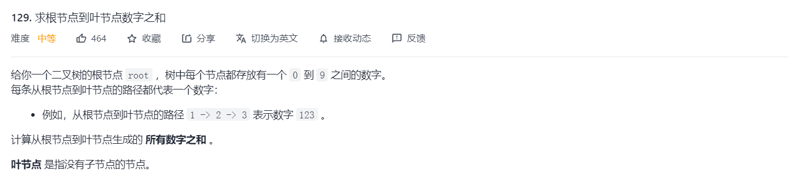
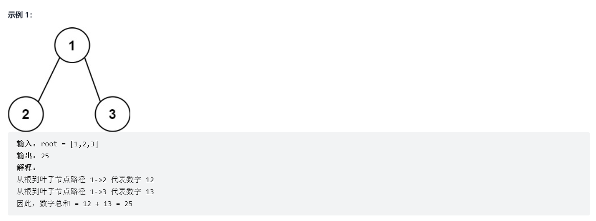
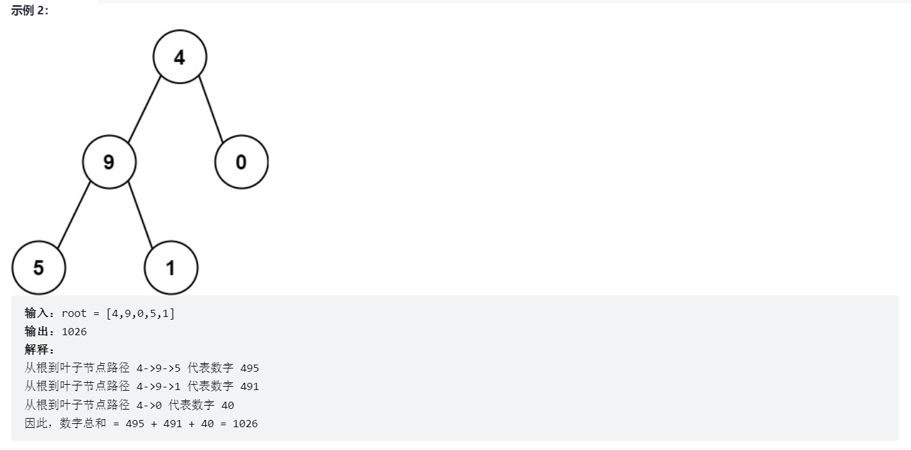
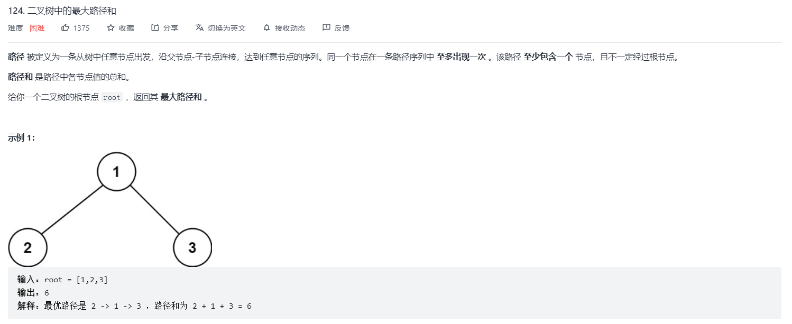
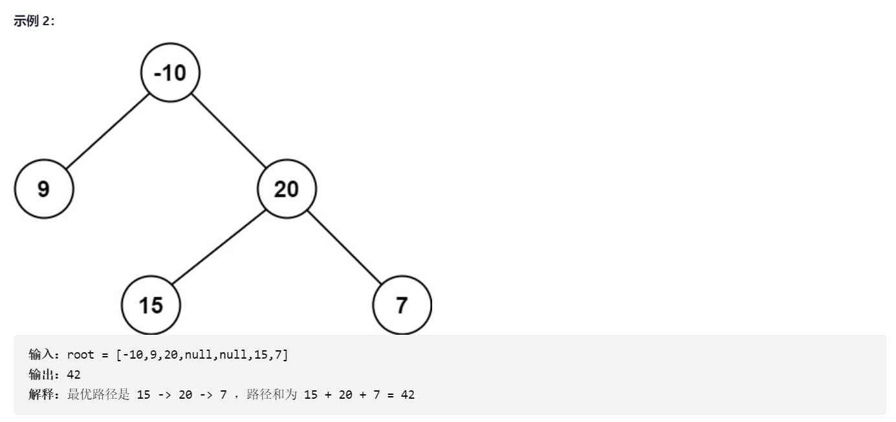
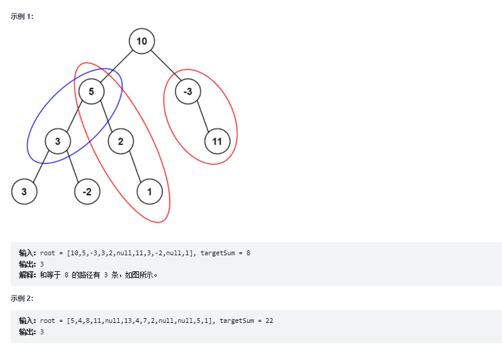

# 二叉树的路径遍历  
  
> 输出二叉树的路径实现注意一下几点  
 
*  遍历路径时是从叶子节点到根节点，即：node.left == null && node.right==null时输出node.val   
*  当node.left != null 时，保存node.left到队列中或者是dfs
*  当node.right != null 时，保存node.right到队列中或者是dfs


```java
 /** 二叉树的路径遍历 */
    private static void getPath(TreeNode root, List<String> re, String s) {
        //此时为叶节点，把s添加到结果列表中，返回
        if(root.left==null && root.right==null) {
            re.add(s+"");
            return ;
        }
        //左子树不为空，递归
        if(root.left!=null)
            getPath(root.left,re,s+"->"+root.left.val);
        //右子树不为空，递归
        if(root.right!=null)
            getPath(root.right,re,s+"->"+root.right.val);
    }


    /** 二叉树的路径遍历：队列BFS算法应用 */
    private static List<String> binTreePath2(TreeNode root) {
        //结果列表
        List<String> l=new ArrayList<String>();
        //存储节点队列
        Queue<TreeNode> queueNode = new LinkedList<TreeNode>();
        //存储路径队列
        Queue<String> queueStrPath = new LinkedList<String>();
        if(root==null)return l;
        queueNode.add(root);
        queueStrPath.add("");
        while(!queueNode.isEmpty()) {
            TreeNode curNode = queueNode.poll();
            String curPath = queueStrPath.poll();
            if(curNode.left==null && curNode.right==null) {
                l.add(curPath+curNode.val);
            }
            if(curNode.left!=null) {
                queueNode.add(curNode.left);
                queueStrPath.add(curPath+curNode.val+"->");
            }
            if(curNode.right!=null) {
                queueNode.add(curNode.right);
                queueStrPath.add(curPath+curNode.val+"->");
            }
        }
        return l;
    }
```  
### 二叉数路径遍历的延申题   

#### 延申1
> 给你二叉树的根节点root 和一个表示目标和的整数targetSum 。判断该树中是否存在 根节点到叶子节点 的路径，这条路径上所有节点值相加等于目标和targetSum 。如果存在，返回 true ；否则，返回 false 。

```java
public boolean hasPathSum(TreeNode root, int targetSum) {
        Queue<Integer> pathSum = new LinkedList<>();
        Queue<TreeNode> nodeQue = new LinkedList<>();
        nodeQue.add(root);
        pathSum.add(0);
        while(!nodeQue.isEmpty()){
            TreeNode node = nodeQue.poll();
            Integer curPathSum = pathSum.poll();
            curPathSum += node.val;
            if(node.left == null && node.right == null){
                if(curPathSum == targetSum)return true;
            }
            if(node.left != null){
                nodeQue.add(node.left);
                pathSum.add(curPathSum);
            }
            if(node.right != null) {
                nodeQue.add(node.right);
                pathSum.add(curPathSum);
            }
        }
        return false;
}

```
#### 延申2
> 给你二叉树的根节点 root 和一个整数目标和 targetSum ，找出所有 从根节点到叶子节点 路径总和等于给定目标和的路径。
  
```java
public List<List<Integer>> pathSum(TreeNode root, int targetSum) {
        List<List<Integer>> result = new LinkedList<>();
        if (null == root)return result;
        Queue<Integer> pathSum = new LinkedList<Integer>();
        Queue<String> path = new LinkedList<>();
        Queue<TreeNode> nodeQue = new LinkedList<>();
        nodeQue.add(root);
        pathSum.add(0);
        while(!nodeQue.isEmpty()){
            TreeNode node = nodeQue.poll();
            Integer curPathSum = pathSum.poll();
            String curPath = path.poll();
            curPathSum += node.val;
            curPath += node.val;
            if(node.left == null && node.right == null){
                if(curPathSum == targetSum){
                    String[] arr = curPath.split("->");
                    List<Integer> list = Arrays.stream(arr).map(Integer::parseInt).collect(Collectors.toList());
                    result.add(list);
                }
            }
            if(node.left != null){
                nodeQue.add(node.left);
                pathSum.add(curPathSum);
                path.add(curPath +"->");
            }
            if(node.right != null) {
                nodeQue.add(node.right);
                pathSum.add(curPathSum);
                path.add(curPath +"->");
            }

        }
        return result;
}
```    
#### 延申3


  
  
```java
public int sumNumbers(TreeNode root) {
        if(root == null)return 0;
        Queue<String> path = new LinkedList<>();
        Queue<TreeNode> nodeQue = new LinkedList<>();
        path.add("");
        nodeQue.add(root);
        int sum = 0;
        while(!nodeQue.isEmpty()){
            TreeNode node = nodeQue.poll();
            String curPath = path.poll();
            curPath += node.val;
            if(node.left == null && node.right == null){
               sum += Integer.parseInt(curPath);
            }
            if(node.left != null){
                path.add(curPath);
                nodeQue.add(node.left);
            }
            if(node.right != null){
                path.add(curPath);
                nodeQue.add(node.right);
            }
        }
        return sum;
}
```

#### 路径的另一种题型  
  
  
  
  
##### 分析  
> 首先，考虑实现一个简化的函数 maxGain(node)，该函数计算二叉树中的一个节点的最大贡献值，具体而言，就是在以该节点为根节点的子树中寻找以该节点为起点的一条路径，使得该路径上的节点值之和最大。
具体而言，该函数的计算如下。 
> 空节点的最大贡献值等于 00。
> 非空节点的最大贡献值等于节点值与其子节点中的最大贡献值之和（对于叶节点而言，最大贡献值等于节点值）。

> 例如，考虑如下二叉树。


    -10    
    / \   
    9  20    
    /  \     
    15   7     

> 叶节点 99、1515、77 的最大贡献值分别为 99、1515、77。    
> 得到叶节点的最大贡献值之后，再计算非叶节点的最大贡献值。   
> 节点 2020 的最大贡献值等于 20+\max(15,7)=3520+max(15,7)=35，    
> 节点 -10−10 的最大贡献值等于 -10+\max(9,35)=25−10+max(9,35)=25。     
上述计算过程是递归的过程，因此，对根节点调用函数 maxGain，即可得到每个节点的最大贡献值。
> 根据函数 maxGain 得到每个节点的最大贡献值之后，如何得到二叉树的最大路径和？对于二叉树中的一个节点，   
> 该节点的最大路径和取决于该节点的值与该节点的左右子节点的最大贡献值，如果子节点的最大贡献值为正，则计入该节点的最大路径和，否则不计入该节点的最大路径和。维护一个全局变量 maxSum 存储最大路径和，在递归过程中更新 maxSum 的值，最后得到的 maxSum 的值即为二叉树中的最大路径和。

```java
class Solution {
int maxSum = Integer.MIN_VALUE;

    public int maxPathSum(TreeNode root) {
        maxGain(root);
        return maxSum;
    }

    public int maxGain(TreeNode node) {
        if (node == null) {
            return 0;
        }
        
        // 递归计算左右子节点的最大贡献值
        // 只有在最大贡献值大于 0 时，才会选取对应子节点
        int leftGain = Math.max(maxGain(node.left), 0);
        int rightGain = Math.max(maxGain(node.right), 0);

        // 节点的最大路径和取决于该节点的值与该节点的左右子节点的最大贡献值
        int priceNewpath = node.val + leftGain + rightGain;

        // 更新答案
        maxSum = Math.max(maxSum, priceNewpath);

        // 返回节点的最大贡献值
        return node.val + Math.max(leftGain, rightGain);
    }
}
```

> 复杂度分析

> 时间复杂度：O(N)O(N)，其中 NN 是二叉树中的节点个数。对每个节点访问不超过 2 次。

> 空间复杂度：O(N)O(N)，其中 NN 是二叉树中的节点个数。空间复杂度主要取决于递归调用层数，最大层数等于二叉树的高度，最坏情况下，二叉树的高度等于二叉树中的节点个数。

### 二叉树的路径和

> 给定一个二叉树的根节点 root，和一个整数 targetSum ，求该二叉树里节点值之和等于 targetSum 的 路径 的数目。

> 路径 不需要从根节点开始，也不需要在叶子节点结束，但是路径方向必须是向下的（只能从父节点到子节点）。

  

```java
 public int pathSum2(TreeNode root, int sum) {
        // key是前缀和, value是大小为key的前缀和出现的次数
        Map<Integer, Integer> prefixSumCount = new HashMap<>();
        // 前缀和为0的一条路径
        prefixSumCount.put(0, 1);
        // 前缀和的递归回溯思路
        return recursionPathSum(root, prefixSumCount, sum, 0);
    }

    /**
     * 前缀和的递归回溯思路
     * 从当前节点反推到根节点(反推比较好理解，正向其实也只有一条)，有且仅有一条路径，因为这是一棵树
     * 如果此前有和为currSum-target,而当前的和又为currSum,两者的差就肯定为target了
     * 所以前缀和对于当前路径来说是唯一的，当前记录的前缀和，在回溯结束，回到本层时去除，保证其不影响其他分支的结果
     * @param node 树节点
     * @param prefixSumCount 前缀和Map
     * @param target 目标值
     * @param currSum 当前路径和
     * @return 满足题意的解
     */
    private int recursionPathSum(TreeNode node, Map<Integer, Integer> prefixSumCount, int target, int currSum) {
        // 1.递归终止条件
        if (node == null) {
            return 0;
        }
        // 2.本层要做的事情
        int res = 0;
        // 当前路径上的和
        currSum += node.val;

        //---核心代码
        // 看看root到当前节点这条路上是否存在节点前缀和加target为currSum的路径
        // 当前节点->root节点反推，有且仅有一条路径，如果此前有和为currSum-target,而当前的和又为currSum,两者的差就肯定为target了
        // currSum-target相当于找路径的起点，起点的sum+target=currSum，当前点到起点的距离就是target
        res += prefixSumCount.getOrDefault(currSum - target, 0);
        // 更新路径上当前节点前缀和的个数
        prefixSumCount.put(currSum, prefixSumCount.getOrDefault(currSum, 0) + 1);
        //---核心代码

        // 3.进入下一层
        res += recursionPathSum(node.left, prefixSumCount, target, currSum);
        res += recursionPathSum(node.right, prefixSumCount, target, currSum);

        // 4.回到本层，恢复状态，去除当前节点的前缀和数量
        prefixSumCount.put(currSum, prefixSumCount.get(currSum) - 1);
        return res;
    }

```
> 去掉注释   
```java
 public int pathSum(TreeNode root, int targetSum) {
        Map<Integer,Integer> map = new HashMap<>();
        map.put(0,1);
        return dfs(root,map,0,targetSum);
    }

    int dfs(TreeNode root, Map<Integer,Integer> map ,int cur ,int targetSum){
        if(null == root)return 0;
        int re = 0;
        cur += root.val;
        re += map.getOrDefault(cur-targetSum,0);
        map.put(cur,map.getOrDefault(cur,0) + 1);
        re += dfs(root.left,map,cur,targetSum);
        re += dfs(root.right,map,cur,targetSum);
        map.put(cur,map.getOrDefault(cur,0) - 1);
        return re;
    }
```
## 二叉树的遍历  
  
### 中序遍历  
  
* 左   
* 根   
* 右   
  
```java
    // List<Integer> r = new LinkedList<>();
    public List<Integer> inorderTraversal(TreeNode root) {
        Deque<TreeNode> stack = new LinkedList<>();
        List<Integer> r = new LinkedList<>();
        if(null == root)return r;
        // 方法一 ：递归方式实现
        //  be( root);  
        // 方法 2：采用迭代法 ---难点在于保存左子树，迭代root
        while(root != null || !stack.isEmpty()){
            // 先将左子树保存到栈中
            while(root != null){
                stack.push(root);
                root = root.left;
            }
            root = stack.pop();
            // 获取左子树的值（有可能也是跟节点的值）
            r.add(root.val);
            // 保存右子树
            root = root.right;
        }
        return r;
    }


    // public void be(TreeNode node){
    //     if(node == null){
    //         return;
    //     }
    //     be(node.left);
    //     r.add(node.val);
    //     be(node.right);
    // }
```


> 序列化是将一个数据结构或者对象转换为连续的比特位的操作，进而可以将转换后的数据存储在一个文件或者内存中，同时也可以通过网络传输到另一个计算机环境，采取相反方式重构得到原数据。

> 请设计一个算法来实现二叉树的序列化与反序列化。这里不限定你的序列 / 反序列化算法执行逻辑，你只需要保证一个二叉树可以被序列化为一个字符串并且将这个字符串反序列化为原始的树结构。

> 提示: 输入输出格式与 LeetCode 目前使用的方式一致，详情请参阅 LeetCode 序列化二叉树的格式。你并非必须采取这种方式，你也可以采用其他的方法解决这个问题。


```java
// Encodes a tree to a single string.
    public String serialize(TreeNode root) {
        List<String> list = new LinkedList<>();
        Queue<TreeNode> queue = new LinkedList<>();
        queue.add(root);
        while(!queue.isEmpty()){
            TreeNode node = queue.poll();
            if(null == node){
                list.add("null");
                continue;
            }
            list.add(String.valueOf(node.val));
            queue.add(node.left);
            queue.add(node.right);
        }
    
        // 由Arrays.asList(split);转化的list，对其进行增删时会报 java.lang.UnsupportedOperationException，解决方法就是基于该转化的list，重新实例化一个list
        while (true){
            int size = list.size();
            if(list.isEmpty())return list.toString();
            if ("null".equals(list.get(size -1))){
                list.remove(size-1);
                continue;
            }
            break;
        }
        return list.toString();
    }


    // Decodes your encoded data to tree.
    public TreeNode deserialize(String data) {
        TreeNode root = null;
        if (null == data || "[]".equals(data.trim()))return root;
        List<String> list = Arrays.asList(data.substring(1,data.length()-1).split(","));
        Queue<TreeNode> queue = new LinkedList<>();
        root = new TreeNode(Integer.parseInt(list.get(0).trim()));
        queue.offer(root);
        int i = 1;
        while (!queue.isEmpty() && i < list.size()){
            TreeNode node = queue.poll();
            if (!"null".equals(list.get(i).trim())){
                node.left = new TreeNode(Integer.parseInt(list.get(i).trim()));
                queue.offer(node.left);
            }
            i++;
            if (i < list.size() && !"null".equals(list.get(i).trim())){
                node.right = new TreeNode(Integer.parseInt(list.get(i).trim()));
                queue.offer(node.right);
            }
            i++;
        }
        return root;  
    }
```

# 二叉搜索树  
  
> 二叉查找树（Binary Search Tree），（又：二叉搜索树，二叉排序树）它或者是一棵空树，或者是具有下列性质的二叉树： 若它的左子树不空，则左子树上所有结点的值均小于它的根结点的值； 若它的右子树不空，则右子树上所有结点的值均大于它的根结点的值； 它的左、右子树也分别为二叉排序树。二叉搜索树作为一种经典的数据结构，它既有链表的快速插入与删除操作的特点，又有数组快速查找的优势；所以应用十分广泛，例如在文件系统和数据库系统一般会采用这种数据结构进行高效率的排序与检索操作。   
   
## 题目练习  

> 给定一个二叉搜索树的根节点 root 和一个值 key，删除二叉搜索树中的 key 对应的节点，并保证二叉搜索树的性质不变。返回二叉搜索树（有可能被更新）的根节点的引用。

> 一般来说，删除节点可分为两个步骤：   

> 首先找到需要删除的节点；  
> 如果找到了，删除它。  
>
> 删除操作一般会出现4种情况：

> 1）情况1：p为叶子结点，直接删除;    
> 2）情况2：p左子树为空, 重接右子树；    
> 3）情况3：p右子树为空，重接左子树；     
> 4）情况4：左右子树都不空，则找到p的右子树的最左端（中序直接后继）,然后从二叉排序树中删除这个直接后继，这样就转换成了前面3种情况。    

```java
public TreeNode deleteNode(TreeNode root, int key) {
        if(null == root)return root;
        if(root.val == key){
            // 左右节点都为空 ,删除当前节点后，树为空
            if(root.left == null && root.right == null)return null;
            // 左节点不为空，右节点为空，删除当前节点后，当前节点的左节点代替当前节点
            if( root.right == null)return root.left;
            // 左节点为空，右节点不为空，删除当前节点后，当前节点的右节点代替当前节点
            if(root.left == null)return root.right;
            // 左右节点都不为空
            // 中序遍历获取右节点最小值作为当前root
            TreeNode node = root.right;
            while(node.left != null){
                node = node.left;
            }
            // 将被删除的节点的左孩子作为被删除节点
            node.left = root.left;
            node = root;
            root = root.right;
            return root;
        }
        if(root.val > key)root.left = deleteNode(root.left,key);
        if(root.val < key)root.right = deleteNode(root.right,key);
        return root;
    }
```

## 树的反转
> 主要是对一棵树的更改，与上面二叉搜索树删除key考察的就是对树结构的改造   
>   
```java
public TreeNode invertTree(TreeNode root) {
        if(root == null)return root;
        Queue<TreeNode> queue = new LinkedList<>();
        queue.offer(root);
        while(!queue.isEmpty()){
            TreeNode node = queue.poll(); 
            TreeNode tmp = node.left;
            node.left = node.right;
            node.right = tmp;
            if(node.left != null){ 
                queue.offer(node.left);
            }
            if(node.right != null){
                queue.offer(node.right);
            }
        }
        return root;
    }
```


